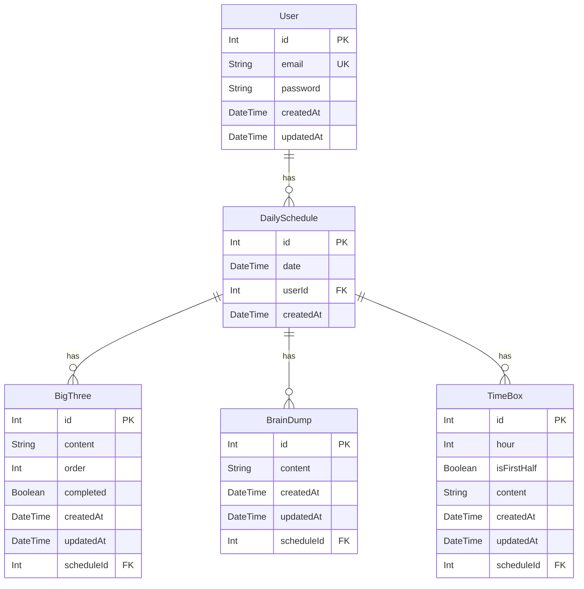

# Database ERD

## Unique Constraints

| Table | Constraint |
|-------|------------|
| `DailySchedule` | `(userId, date)` — 유저당 날짜 하나 |
| `BigThree` | `(scheduleId, order)` — 스케줄당 순서 중복 불가 |
| `TimeBox` | `(scheduleId, hour, isFirstHalf)` — 스케줄당 30분 슬롯 하나 |

## Cascade Rules

모든 자식 테이블(`DailySchedule`, `BigThree`, `BrainDump`, `TimeBox`)은 부모 삭제 시 `onDelete: Cascade` 적용.
